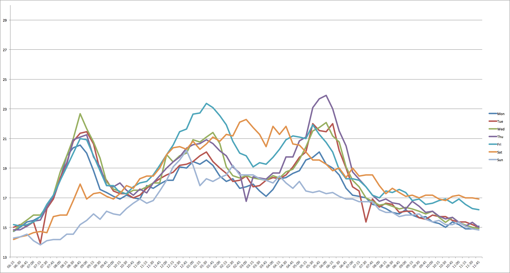
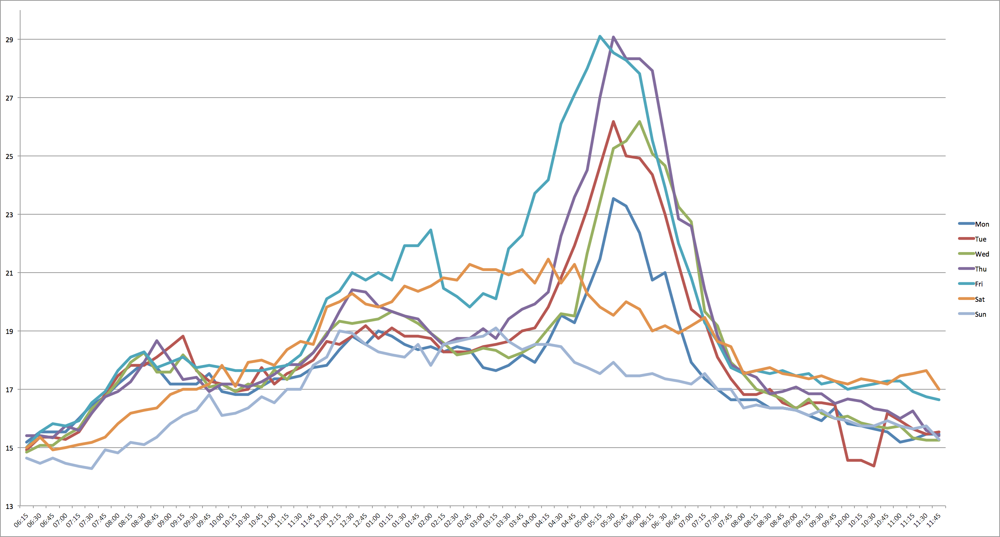

# traffic-student

##### Not network traffic... street traffic.
Collect data for an automobile's travel time between two locations **with traffic factored in**. traffic-student scrapes Google Maps to find the travel times in traffic between a user-defined point a and point b at the time of the request. Then, it dumps those travel times into two CSV files: one for a to b and one for b to a.

### Command structure
`node scrape.js address_a address_b [output_file_a_to_b] [output_file_b_to_a]`

The output files default to `a_to_b.csv` and `b_to_a.csv` respectively.

### Prerequisites
In order to get traffic-student running, you will first need to install Node.js and NPM if you don't have them already. The easiest place for you to get them is probably [here](http://nodejs.org/download/). The installer should install both Node.js and NPM.

Run `npm install` in traffic-student's root directory.

### Putting traffic-student to work
traffic-student is intended to be run in a cron job. For example, on your Unix-like always-on box (you're on your own, Windows users), type `crontab -e` and enter the following line:

`*/15 * * * * cd <traffic-student's root directory>; node scrape.js address_a address_b`

Note: it's possible you'll need to give the full path the `node` if your cron isn't able to find the command. Run `which node` to find node's full path.

Ex: `*/15 * * * * cd <traffic-student's root directory>; /usr/local/bin/node scrape.js address_a address_b`

If something's still not going right, you could always log standard error to an output file like so: `<my screwed up crontab entry> 2> ~/Desktop/error.txt`

Running this cron job will run traffic-student on the `00`, `15`, `30`, and `45` minute marks of every hour of every day of the week. It will get the number of minutes of travel time in traffic* both directions and append those integers to the csv files. There are some prepared output files in traffic-student's root directory with column headers already set up.

Once you set up the cron job**, let traffic-student run for a few weeks, or even better, a few months. Then, drop the csv files into excel, and make some pretty line charts like the ones below.

### What traffic student can do for you

*x-axis: time of day, y-axis: travel time in minutes*

**from my home to work**

**from my work to home**

These are the results from a few months' worth of traffic-student collecting data. I found these results pretty interesting. You may notice a few trends:

- a morning, lunch, and afternoon rush during weekdays
- traffic generally getting worse as the workweek goes on (Friday is significantly worse than Monday)
- largest lunch rush on Friday... makes sense
- going from work to home for me sucks relatively more if I go at peak times

Overall, this was really useful and definitely informs my decisions about how I make my commute. Hopefully it can do the same for you, too.

### Example commands
`node scrape.js "215 N Lumpkin St Athens, GA 30601" "660 Peachtree St NE, Atlanta, GA 30308"`

`node scrape.js "215 N Lumpkin St Athens, GA 30601" "660 Peachtree St NE, Atlanta, GA 30308" my_custom_file1.csv my_custom_file2.csv`

### Helpful Hints
\* Sometimes Google does not return the travel time in traffic at all. In this case, traffic-student will write a travel time of `0` to the csv. This generally happened between 1am and 5am for me, so I ended up cutting off the first six hours of each day's data on my results.

\*\* Ideally, you'll want to do the initial kick off of your cron job after 11:45pm and before 12:00am. That way, you'll get a full row of values for your first day.
